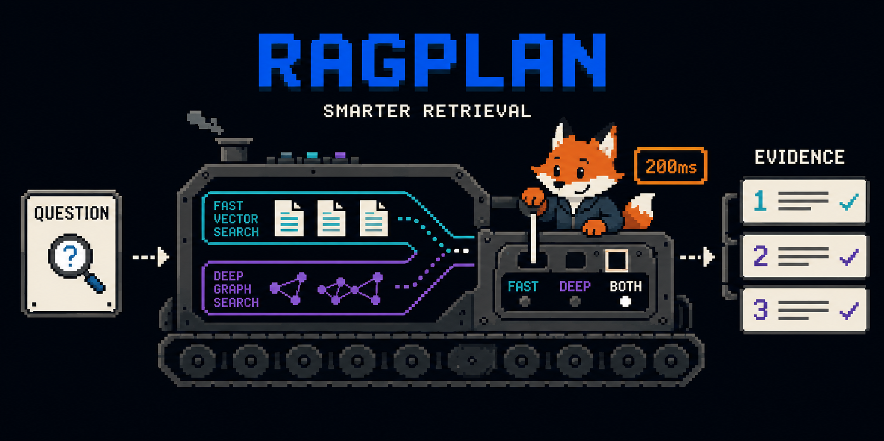

<p align="center">
  <a href="README.md">한국어</a> · <strong>English</strong>
</p>

<h1 align="center">RAGPlan</h1>

<p align="center">
  <strong>The right retrieval plan for every query, within its latency budget.</strong><br>
  An open-source retrieval control plane for Vector · Graph · Hybrid execution
</p>

<p align="center">
  <a href="https://github.com/iamdbstjd/OSS_2026/actions/workflows/ci.yml"></a>
  <a href="LICENSE"></a>
  
  
  
</p>

<p align="center">
  <a href="#quick-start">Quick Start</a> ·
  <a href="#how-it-works">How It Works</a> ·
  <a href="#retrieval-modes">Retrieval Modes</a> ·
  <a href="#cli">CLI</a> ·
  <a href="#verified-evidence">Verified Evidence</a> ·
  <a href="#contributing">Contributing</a>
</p>

<p align="center">
  
</p>

<p align="center">
  <em>RAGPlan is not another RAG chatbot. It decides, executes, and verifies which evidence an LLM receives.</em>
</p>

---

## What RAGPlan Does

RAGPlan accepts a query and a latency budget, selects a retrieval plan, executes Qdrant and Neo4j
within one deadline, and returns ranked evidence with an explainable trace.

It does not own answer generation or bind you to one model provider. Place it in front of an
OpenAI, local-model, or existing RAG pipeline to manage **retrieval strategy, deadlines, parallel
branches, and fallback**.

```text
Question + latency budget
          │
          ▼
   Query Analyzer ──► Rule Planner
                          │
                          ▼
                Deadline-aware Scheduler
                    ┌─────┴─────┐
                    ▼           ▼
            MiniLM + Qdrant   Neo4j Graph
                    └─────┬─────┘
                          ▼
                    Weighted RRF
                          ▼
              Ranked Evidence + Redacted Trace
                          ▼
                       Any LLM
```

## What You Get

| Capability | What it provides |
|---|---|
| Budget-aware planning | Selects a feasible plan from remaining time, query features, and backend state |
| Vector · Graph · Hybrid | MiniLM semantic search, bounded graph traversal, parallel retrieval, and Weighted RRF |
| Deadline semantics | One monotonic absolute deadline from request ingress through response construction |
| Graceful degradation | Preserves the successful branch when a sibling backend fails |
| Fail-closed model serving | Blocks learned models from public runtime when validation gates fail |
| Evidence-first observability | Records selection reasons, branch latency, fallback, and provenance in a redacted trace |
| Reproducible evaluation | Frozen query·plan·budget matrices, Oracle@Budget, and checksum-linked evidence |

## Quick Start

### One-minute planner-only demo

No database, embedding model, or Docker is required.

```bash
git clone https://github.com/iamdbstjd/OSS_2026.git
cd OSS_2026

uv sync --frozen
uv run ragplan demo-plan \
  --query "Who founded Acme and who acquired it?" \
  --budget-ms 100 \
  --entity-count 2 \
  --pretty
```

The output shows the selected plan, candidate p95 estimates, exclusion reasons, and whether any
retrieval was actually executed.

```json
{
  "mode": "planner_only_no_embedding",
  "executes_retrieval": false,
  "decision": {
    "selected_plan_id": "P1",
    "effective_mode": "vector",
    "fallback_reason": "graph_audit_gate:human review and adjudication are incomplete"
  }
}
```

`demo-plan` never fabricates embeddings or retrieval results. It analyzes lightweight query
features and explicitly reports `executes_retrieval=false`.

### Run a real vector search

Start only Qdrant. RAGPlan will prepare the checksum-pinned MiniLM model, ingest the packaged sample
corpus, and search through the production vector engine.

```bash
cp .env.example .env
docker compose up -d qdrant
uv run ragplan quickstart-vector --pretty
```

This single command performs the following steps:

1. Download the approved `all-MiniLM-L6-v2` revision
2. Verify every model file against its SHA-256 allowlist
3. Deterministically chunk and ingest the sample corpus into Qdrant
4. Verify canonical IDs, count, and schema
5. Execute a real vector search and return a redacted trace

The quickstart sample-v2 explicitly records the source-case-preserving
`token-window-220-overlap-40-v2` contract. Existing benchmark and active-corpus evidence retains
the original `token-window-220-overlap-40-v1` token-ID decode contract and checksums.

### Verify the installation

```bash
uv run ragplan verify --pretty
uv run ragplan qa --level smoke --pretty
```

Increase the QA level as infrastructure becomes available.

```bash
# Qdrant + MiniLM + sample ingest/search
uv run ragplan qa --level vector --pretty

# An activated dual-store API
uv run ragplan qa \
  --level full \
  --api-url http://127.0.0.1:8000 \
  --pretty
```

Every QA report records `held_out_test_accessed=false`.

## How It Works

### 1. Analyze

The `qf_v1` analyzer computes token count, entity density, relation, comparison, multi-hop, and
aggregation signals once. Service traces never contain the raw query or query embedding.

### 2. Plan

The Rule planner uses remaining budget, static p95 profiles, graph-audit state, and circuit state to
choose a feasible plan from the P0–P8 catalog. Selection and prediction values remain separate from
the immutable plan definition.

### 3. Execute

Vector and Graph branches execute concurrently under the same absolute deadline. The scheduler
reserves `min(20ms, max(5ms, budget × 5%))` for response finalization.

### 4. Fuse and explain

Hybrid results are deduplicated by canonical chunk ID and fused with `weighted_rrf_v1`. Final hits
retain per-source rank, score, contribution, graph path, and fallback evidence.

## Retrieval Modes

| Planner | Behavior | Current status |
|---|---|---|
| `vector` | MiniLM + Qdrant semantic search | Available |
| `graph` | Neo4j bounded 1–3 hop traversal | Available as an explicit comparison mode over an active corpus |
| `fixed_hybrid` | Parallel Vector and Graph + Weighted RRF | Available over an active dual-store corpus |
| `rule` | Rule-based selection from query, budget, and backend state | Default online planner |
| `cost_aware` | Learned quality and latency model selection | `research_only`; disabled in the public API |


## CLI

| Command | Purpose | Required infrastructure |
|---|---|---|
| `ragplan demo-plan` | Explain a Rule decision without retrieval | Python only |
| `ragplan download-model` | Download and checksum-verify the pinned MiniLM | Network access |
| `ragplan quickstart-vector` | Run sample ingestion through real vector search | Qdrant |
| `ragplan ingest` | Idempotently stage a user corpus in Qdrant | Qdrant + MiniLM |
| `ragplan search` | Search a local runtime or REST API | Configured runtime |
| `ragplan verify` | Validate package, configuration, and optional live dependencies | Optional infrastructure |
| `ragplan qa` | Run `smoke`, `vector`, or `full` QA | Depends on level |
| `ragplan benchmark` | Run the Stage 9 baseline or Stage 10 profiler | Dedicated dual-store environment |

```bash
uv run ragplan --help
uv run ragplan search --help
```

## Infrastructure Levels

You do not need Qdrant and Neo4j just to evaluate the project.

| Goal | Required components |
|---|---|
| Inspect the code and planner | Python 3.12 + `uv` |
| Run a real vector demo | Qdrant + checksum-pinned MiniLM |
| Run full vector·graph·hybrid retrieval | Qdrant + Neo4j + active corpus |
| Build a new graph corpus | The above + pinned spaCy `en_core_web_sm` |
| Authentication, multi-tenancy, or agent loops | Not supported |

### Prepare a full dual-store corpus

The full runtime does not activate merely because two databases are running.

1. Create a Qdrant corpus and vector-stage manifest with `ragplan ingest`
2. Ingest the exact same chunks into inactive Neo4j state with `scripts/ingest_graph.py`
3. Reconcile counts and canonical-ID checksums with `scripts/activate_corpus.py`
4. Replace the active-corpus pointer only after successful verification
5. Configure the Stage 6 runtime variables from `.env.example`, then start the API

The activation `--chunker-version` must exactly match the vector-stage manifest. RAGPlan rejects
any attempt to label a v2 corpus as frozen v1 evidence.

```bash
cp .env.example .env
# Configure the Stage 6 runtime variables and a non-demo Neo4j password first.
docker compose up -d --build
uv run ragplan verify --configured-runtime --pretty
```

Partial configuration, model checksum drift, and Qdrant·Neo4j ID mismatch all fail closed. See the
[benchmark documentation](docs/benchmark.md) for evaluation contracts and run
`scripts/ingest_graph.py --help` or `scripts/activate_corpus.py --help` for ingestion arguments.

## REST API

```bash
curl --fail http://127.0.0.1:8000/health
curl --silent --show-error http://127.0.0.1:8000/ready
curl --silent --show-error http://127.0.0.1:8000/metrics
```

| Endpoint | Meaning |
|---|---|
| `GET /health` | Process liveness |
| `GET /ready` | Corpus and backend capability; reports `degraded` when Neo4j is unavailable |
| `GET /metrics` | Request, result, error, planner, latency, and trace-writer metrics |
| `POST /v1/search` | Retrieval through a strict `SearchRequest` contract |

The CLI can call a configured API directly.

```bash
uv run ragplan search \
  --api-url http://127.0.0.1:8000 \
  --query "What did Ada Lovelace write about?" \
  --planner rule \
  --budget-ms 500 \
  --top-k 3 \
  --pretty
```

## Pass Evidence to an LLM

RAGPlan does not own answer generation. The [generic LLM handoff example](examples/llm_handoff.py)
converts ranked `SearchResponse` chunks into provider-neutral messages without importing any LLM
SDK.

```bash
uv run ragplan search \
  --query "What did Ada Lovelace write about?" \
  --planner vector \
  --pretty > /tmp/ragplan-response.json

uv run python examples/llm_handoff.py \
  --response /tmp/ragplan-response.json \
  --question "What did Ada Lovelace write about?"
```

## Resilience and Privacy

- Up to 32 in-flight requests with queue-free admission control
- Per-backend circuit opening for 30 seconds after five consecutive failures, with one half-open probe
- No request-internal retries
- Typed partial responses that preserve the successful branch when a sibling fails
- Cancellation and awaiting of every child task after client disconnect
- `RAGPLAN_FORCE_VECTOR_ONLY` and `RAGPLAN_DISABLE_COST_AWARE` kill switches
- Parameterized Cypher and a 32KiB request limit
- Redacted traces without raw queries, embeddings, complete documents, or arbitrary metadata
- Fixed 10MiB rotation with at most five files including the current file
- Trace queue overflow and filesystem failures isolated from retrieval

Service mode accepts only `RAGPLAN_LOGGING__MODE=redacted` and rejects every other value at startup.
Drops and write failures appear as `trace_dropped_count` and `trace_write_failure_count` in
`/metrics`.

## Verified Evidence

RAGPlan does not report only successful outcomes. Timeouts, backend errors, partial responses, and
zero-hit results remain in raw evidence and evaluation denominators.

| Evidence | Scale or result |
|---|---|
| Frozen benchmark | 600 queries with a 360/120/120 train/validation/test group split |
| Active dual-store corpus | 8,604 canonical chunks in both Qdrant and Neo4j |
| Stage 9 baseline | 224,640 raw trial rows |
| Stage 10 profiler | 199,680 raw trial rows |
| Total execution evidence | 424,320 rows |
| Training matrix | 15,360 rows |
| Oracle@Budget | 1,920 labels |
| Quality model | Validation MAE 0.009219 |
| Latency model | Overall p95 coverage 0.928368 |


The current serving state is therefore:

```text
Online default      rule
Rule graph routing  disabled until human audit
Cost-aware serving  disabled
Cost-aware status   research_only / offline comparison only
```

## Intended Users and Scope

### A good fit for

- RAG teams that need to vary vector and graph strategy within a latency SLO
- AI infrastructure teams that need deadlines, circuit breakers, and partial results
- Researchers reproducing query×plan×budget matrices and Oracle@Budget
- Services that need an LLM-independent ranked-evidence layer

### Deliberately not included

- A complete question-answering UI or LLM answer generation
- Authentication, multi-tenancy, or a distributed production control plane
- Agent loops or tool orchestration
- Claims of automatic graph quality without human review
- Public serving of the `research_only` cost model

## Development

### Requirements

- Python 3.12
- [uv](https://docs.astral.sh/uv/)
- Docker Engine + Docker Compose v2 — only for integration work

### Quality checks

```bash
uv sync --frozen
uv run ruff format --check .
uv run ruff check .
uv run mypy src
uv run pytest -m "not integration and not e2e"
```

Run real-backend integration tests only when their dependencies are available.

```bash
MODEL_SNAPSHOT="models/minilm/models--sentence-transformers--all-MiniLM-L6-v2/snapshots/b8903db39f65d93ae28d49a37c4f3fa90c5f94e0"

RAGPLAN_TEST_QDRANT_URL=http://127.0.0.1:6333 \
RAGPLAN_TEST_MODEL_SNAPSHOT="$MODEL_SNAPSHOT" \
uv run pytest -q tests/integration/test_qdrant_vector_backend.py

RAGPLAN_TEST_NEO4J_URI=bolt://127.0.0.1:7687 \
RAGPLAN_TEST_NEO4J_USER=neo4j \
RAGPLAN_TEST_NEO4J_PASSWORD=ragplan-demo-change-me \
uv run pytest -q tests/integration/test_graph_retrieval.py
```

## Documentation

- [Graph, Hybrid, Scheduler, and Rule runtime operations](docs/runtime.md)
- [Benchmark protocol and Stage 9·10 evidence](docs/benchmark.md)
- [Stage 11 model training and validation gates](docs/model_training.md)
- [Stage 12 offline cost policy](docs/offline_cost_policy.md)
- [LLM handoff and usage examples](examples/README.md)
- [Third-party software, model, and dataset licenses](THIRD_PARTY_LICENSES.md)
- [Security policy](SECURITY.md)

## Contributing

Issues and pull requests are welcome. Before making a change, read [CONTRIBUTING.md](CONTRIBUTING.md)
for the development environment, test, privacy, and artifact contracts.

```bash
git clone https://github.com/iamdbstjd/OSS_2026.git
cd OSS_2026
uv sync --frozen
uv run pytest -m "not integration and not e2e"
```

For vulnerabilities that should not be discussed in a public issue, follow the private advisory
process in the [Security Policy](SECURITY.md).

## License

RAGPlan's original source code is released under the [Apache License 2.0](LICENSE).

Qdrant, Neo4j, Sentence Transformers, MiniLM, spaCy, and benchmark datasets retain their respective
licenses. Exact revisions, image digests, checksums, and attribution are recorded in
[THIRD_PARTY_LICENSES.md](THIRD_PARTY_LICENSES.md).

---

<p align="center">
  Built by <strong>ProSit</strong> · Evidence before claims · Fail closed, recover gracefully
</p>
